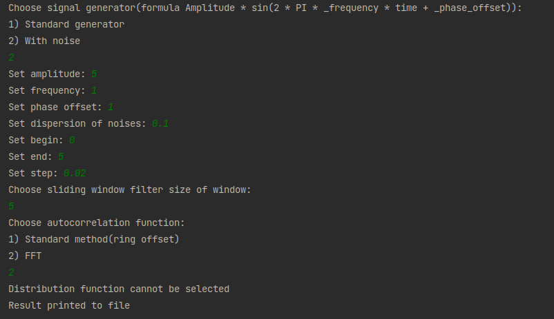
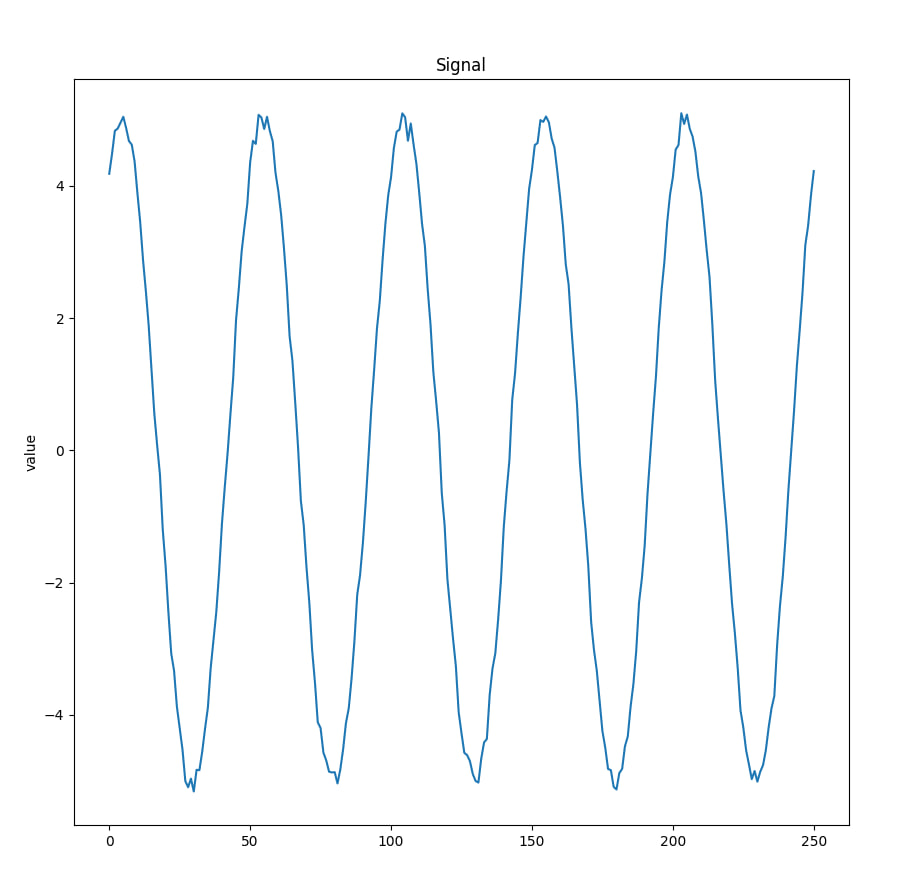
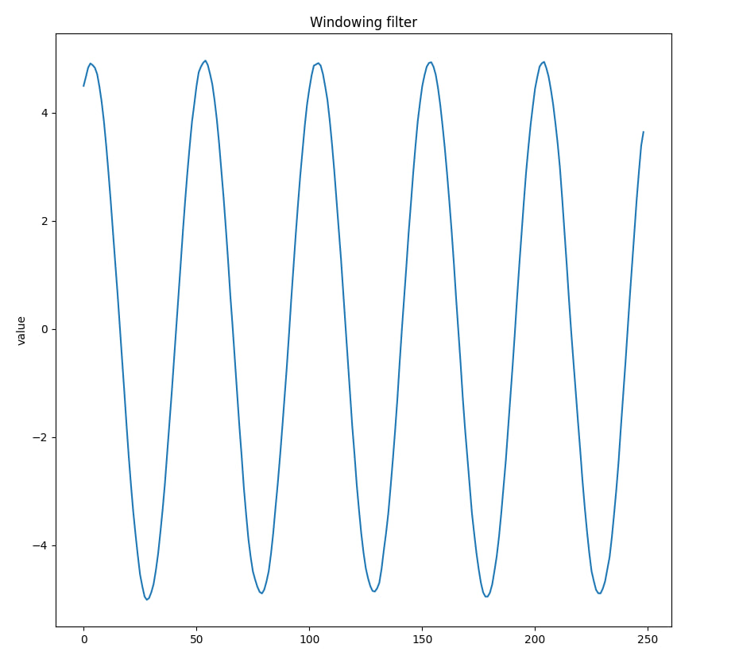
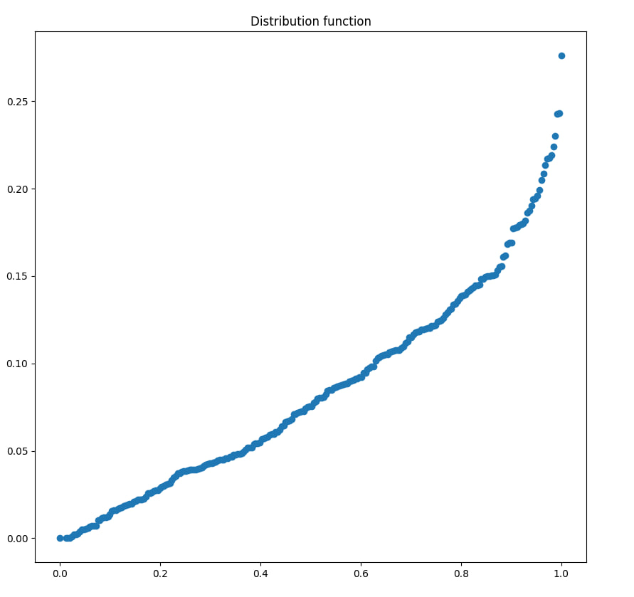

# digital-signal-processing

## Технологии и ограничения:
- Языки программирования: Java, Python, C++;
- Дополнительные библиотеки: Apache math3;

## Постановка задачи:

1.	Реализовать программный модуль фильтрации входящего сигнала на основе скользящего окна;
2.	Найти временной ряд отклонений (дисперсий) и построить их функцию распределения;
3.	Построить автокорреляционную функцию временного ряда:
    - Реализовать при помощи стандартного способа (кольцевого смещения);
    - При помощи БПФ;

## Общие требования по выполнению:
1. Код должен быть написан понятно и аккуратно, с соблюдением табуляции и прочих элементов написания, без лишних элементов и функций, не имеющих отношения к функционалу тестового задания, снабжен понятными комментариями.
2. Чистота и оформление кода — не менее важный фактор. Код должен быть написан в едином стиле (желательно в рекомендуемом для конкретного языка). Также к чистоте относятся отсутствие копипаста и дублирования логики.
3. Исходные коды должны быть в Git. Желательно делать частые информативные коммиты, активно использовать ветки.
4. Должна быть инструкция по сборке и разворачиванию, а также должен быть описан порядок развертывания и запуска проекта в среде разработки (включая настройку БД, дамп схемы БД, настройку сервера приложения для запуска и т.д.)
5. Сервисы (серверная часть) должны быть максимально покрыты модульными тестами
6. Интерфейс должен отвечать требованиям usability

## Зависимости
Для С++ присутствует единственная зависимость The Fastest Fourier Transform in the West (FFTW) - это библиотека для вычисления дискретного преобразования Фурье (ДПФ) в одном или нескольких измерениях, произвольного входного размера и как действительных, так и комплексных данных(а также четных/нечетных данных, то есть дискретных косинусных/синусных преобразований). Для Python, который используется для визуализации данных требуется matplotlib.

## Сборка
Необходимо заранее установить самостоятельно FFTW и matplotlib перед сборкой проекта
```
mkdir build
cd build
cmake ..
make
```

## Запуск
Для запуска необходимо запустить исполняемый файл digital-signal-processing/digital-signal-processing.exe и выполнить run-plotter.sh/run-plotter.cmd, которому при необходимости выдать права на исполнение с помощью команды
```
chmod +x run-plotter.sh
```

## Пример работы программы

Результат работы программы можно наглядно продемонстрировать на графиках

### CLI интерфейс

### Сгенерированный сигнал

### Фильтрация на основе скользящего окна

### Автокорреляционная функция

### Функция распределения


Числовые значения отработанных функций передаются в файл result.txt по умолчанию